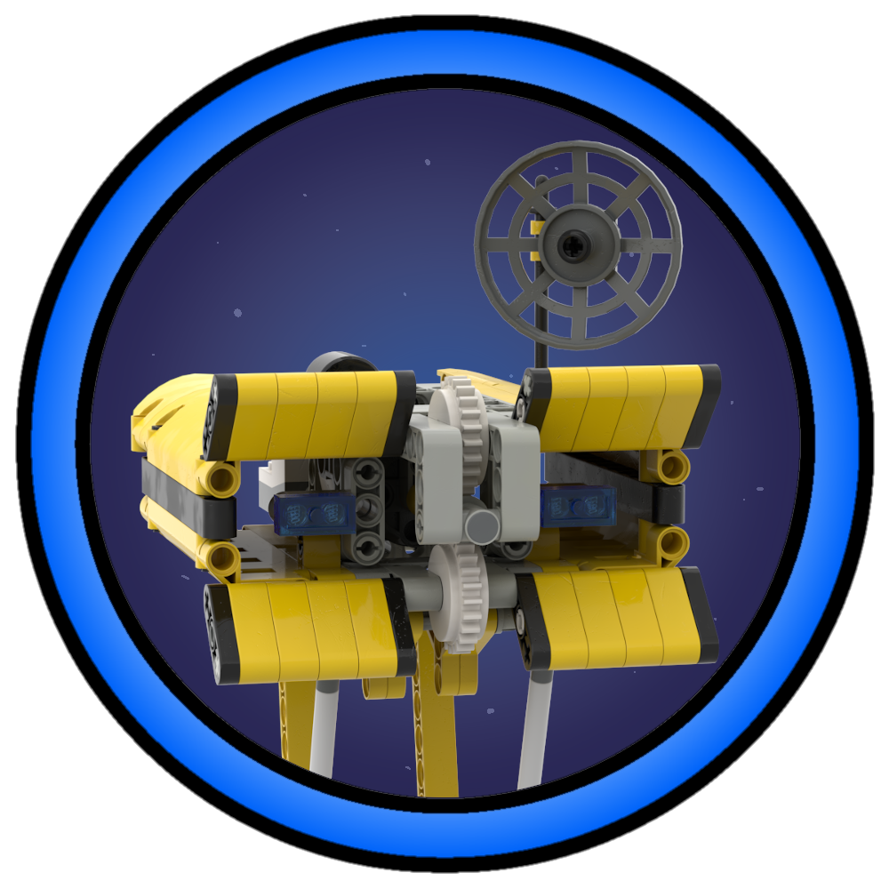

# dotfiles



Hi :)

## References

Some parts of my setup are heavily inspired by others.

### User [Treeniks](https://github.com/Treeniks):
- **nvim**: He basically taught me almost everything I know about vim/nvim. So I inherited his setup.
- **waybar**: I used his **waybar** as a starting point, since it is designed to work with minimal linux installs (no bullshit, clean and simple). I color matched my version to match the catppuccin-mocha palette and added some simple additional elements.
- **dotfiles organisation**: I really liked his `link.jl` scripts!

### User [AndreasChris](https://github.com/AndreasChris):
- **vim**: I'm currently using **nvim** as my main editor, but sometimes it might not be possible for me to use it (e.g. remote server where I can't install any packages). Andreas was so kind to give me his `.vimrc` which I found to be very reliable. I probably won't change it, since I will use **nvim** vherever possible. Here is a [link](https://itsec.tum.academy/.vimrc) to his `vim.rc`.

## Bootloader

I personally like to use **Grub**, since it has always worked for me without a hitch.

- [Grub2 Themes](https://github.com/vinceliuice/grub2-themes)

## Folder Icons

- [Catppuccin Papirus](https://github.com/catppuccin/papirus-folders)

## GTK

- [Catppuccin gtk](https://github.com/catppuccin/gtk)

## Wallpapers

- [Catppuccin](https://github.com/Gingeh/wallpapers)
- [HQ Anime Wallpapers](https://www.flickr.com/photos/147283717@N03/albums)
- [wdsrocha's wallpapers](https://github.com/wdsrocha/wallpapers)
- [Gwynsav's walls](https://github.com/Gwynsav/walls)

## Setup Stuff I might forget

### Linux User Groups:

Add yourself to the groups:
```
wheel video audio input
```
